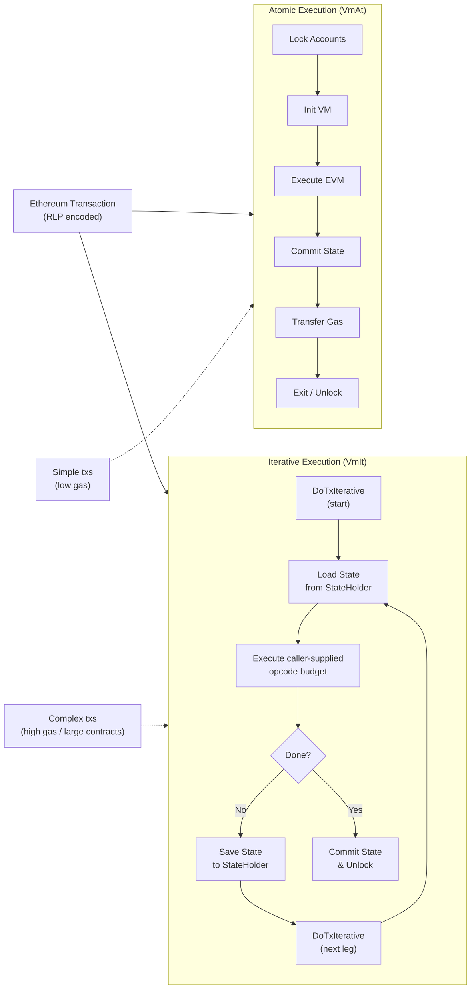
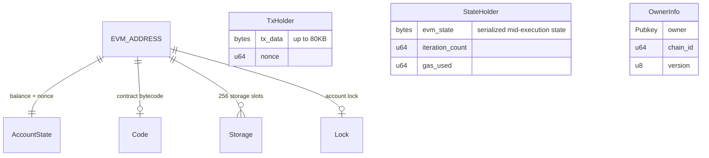
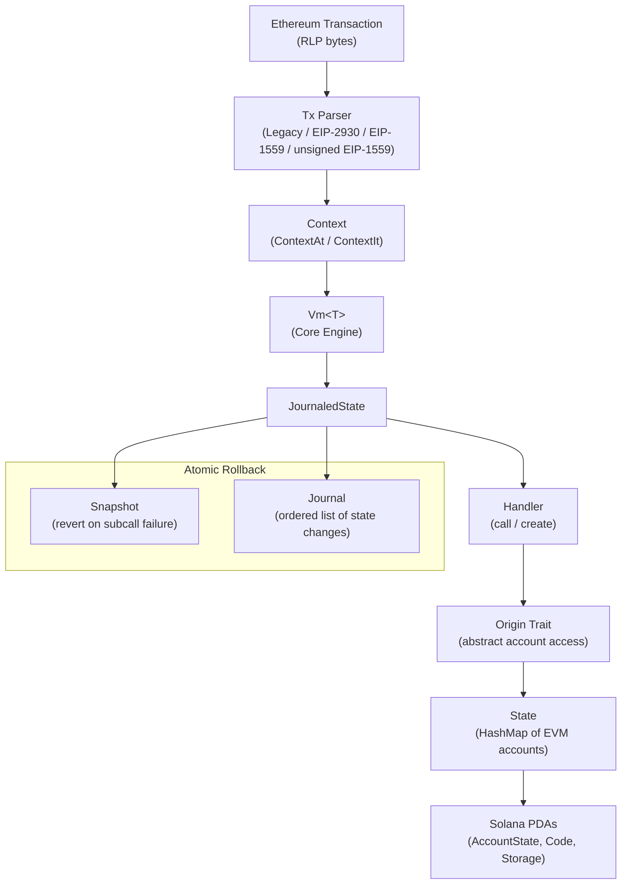

# Rome EVM

A Solana-based Ethereum Virtual Machine (EVM) implementation that runs Ethereum smart contracts under Solana settlement, with first-class interoperability between the two ecosystems: Solidity contracts invoke native Solana programs via the CPI precompile. Liquidity flows in both directions — EVM contracts can consume Solana DEX / lending / oracle liquidity AND contribute Rome-side liquidity back. Rome EVM is the core execution layer of the [Rome Protocol](https://www.romeprotocol.xyz/) — a unified liquidity and cross-chain interoperability system.

> **Source-available, proprietary license.** This repository is published under a proprietary license: all rights reserved, free for personal, non-commercial use only. Commercial use requires written permission from Rome Protocol. See [License](#license).

---

## Table of Contents

- [Overview](#overview)
- [Deployed Programs](#deployed-programs)
- [Architecture](#architecture)
  - [High-Level Architecture](#high-level-architecture)
  - [Execution Models](#execution-models)
  - [Account Model](#account-model)
  - [State Management](#state-management)
  - [Instruction Dispatch](#instruction-dispatch)
- [Components](#components)
  - [Program Crate](#program-crate)
  - [Emulator Crate](#emulator-crate)
  - [Macros Crate](#macros-crate)
  - [Solidity Contracts](#solidity-contracts)
- [Precompiles](#precompiles)
- [Solana Bridges (Non-EVM)](#solana-bridges-non-evm)
- [EVM Semantics Divergences](#evm-semantics-divergences)
- [Transaction Types](#transaction-types)
- [Build & Deploy](#build--deploy)
  - [Prerequisites](#prerequisites)
  - [Build](#build)
  - [Test](#test)
  - [Deploy (local validator)](#deploy-local-validator)
  - [Extend Program Account](#extend-program-account)
- [Verifying the Mainnet Build](#verifying-the-mainnet-build)
- [Continuous Integration](#continuous-integration)
- [Configuration](#configuration)
- [Security](#security)
- [Contributing](#contributing)
- [License](#license)

---

## Overview

Rome EVM interprets and executes Ethereum transactions as a Solana on-chain program. It bridges the EVM ecosystem to Solana by:

- Executing Ethereum transactions and smart contracts on-chain as a Solana program
- Managing EVM account state (balances, nonces, contract code, storage) as Program Derived Addresses (PDAs)
- Supporting both **atomic** (single Solana transaction) and **iterative** (multi-step across multiple Solana transactions) execution modes for handling Solana's compute unit limits
- Bridging EVM contracts to native Solana programs (SPL Token / Token-2022, System Program, Associated Token Accounts, and arbitrary programs via CPI)
- Implementing standard EVM precompiles (ecrecover, SHA-256, BN254, BLAKE2f, etc.)

---

## Deployed Programs

| Network | Program ID | Build features | Upgrade authority |
|---|---|---|---|
| Solana mainnet-beta | [`RomePq9X3iAoTr813HR7uRarafFDUJty6GdiEceYpzX`](https://explorer.solana.com/address/RomePq9X3iAoTr813HR7uRarafFDUJty6GdiEceYpzX) | `custom-heap,mainnet` | Squads multisig [`DML4U1jMpWCu3uFiVxQTtXLzor1wtSRLRaEczXKqEz4n`](https://app.squads.so/squads/DML4U1jMpWCu3uFiVxQTtXLzor1wtSRLRaEczXKqEz4n/home) |

The mainnet program was audited by [Halborn](https://www.halborn.com/). The deployed binary can be reproduced from this repository. See [Verifying the Mainnet Build](#verifying-the-mainnet-build).

---

## Architecture

### High-Level Architecture

```mermaid
flowchart TB
    subgraph Clients["Clients / Rollup Nodes"]
        ETH[Ethereum RPC Client]
        SDK[Rome SDK]
    end

    subgraph RomeEVM["Rome EVM — Solana On-Chain Program"]
        direction TB
        subgraph API["Instruction API (22 dispatch slots, 16 active)"]
            DoTx["DoTx / DoTxHolder\n(Atomic)"]
            DoTxIt["DoTxIterative / DoTxHolderIterative\n(Iterative Start)"]
            Transmit["TransmitTx\n(stage tx data in TxHolder)"]
            Unsigned["DoTxUnsigned / ActivateAta\n(Solana-key users)"]
            Deposit["Deposit / SettleInboundBridgeV2\n(Bridge In)"]
            RegOwner["RegOwner"]
            Treasure["CreateTreasure / JoinTreasure"]
            Resource["AllocResource / DeallocResource"]
        end

        subgraph VM["Virtual Machine"]
            VmAt["VmAt\n(Atomic VM)"]
            VmIt["VmIt\n(Iterative VM)"]
        end

        subgraph EVM["EVM Core (fork of rome-protocol/evm)"]
            JState["JournaledState"]
            Handler["Call / Create Handlers"]
            Precompile["Precompiles\n(ecrecover, sha256, bn254, ...)"]
        end

        subgraph State["State Layer"]
            Origin["Origin Trait\n(account / storage access)"]
            StateMgr["State Manager\n(HashMap-backed)"]
        end

        subgraph NonEVM["Solana Bridges (non_evm / non_evm_cached)"]
            SPL["SPL Token / Token-2022"]
            ASPL["Associated SPL Token"]
            SYS["System Program"]
            CPI["Generic CPI + account reads"]
            Withdraw["Withdraw\n(Bridge Out)"]
        end
    end

    subgraph SolanaAccounts["Solana Account Storage (PDAs)"]
        AccState["AccountState\n(balance, nonce)"]
        Code["Code\n(contract bytecode)"]
        Storage["Storage\n(256 slots / contract)"]
        StateHolder["StateHolder\n(iterative state)"]
        TxHolder["TxHolder\n(tx data cache)"]
        OwnerInfo["OwnerInfo\n(chain registration)"]
        Lock["Lock\n(concurrency control)"]
    end

    Clients -->|"RLP-encoded txs\nSolana instructions"| API
    API --> VM
    VM --> EVM
    EVM --> State
    State --> SolanaAccounts
    EVM --> NonEVM
    NonEVM -->|"CPI calls"| SolanaAccounts
```



---

### Execution Models

Rome EVM supports two execution models to work within Solana's compute unit constraints:



**Atomic execution** — The entire transaction is executed within a single Solana transaction. Suitable for simple transfers and low-complexity contract calls.

**Iterative execution** — Complex contracts that exceed Solana's compute budget are split across multiple Solana transactions. A `StateHolder` account persists the EVM mid-execution state between iterations. The per-iteration opcode budget is a `limit` field supplied by the caller in the `DoTxIterative` / `DoTxHolderIterative` instruction data. `NUMBER_OPCODES_PER_TX` (500) remains in `config.rs` only as the historical emulator baseline. A session is released and marked completed after `MAX_SESSION_ITERATIONS` (160) iterations.

---

### Account Model

All EVM state is stored as Program Derived Addresses (PDAs) on Solana:



| Account Type | Description |
|---|---|
| `AccountState` | EVM account balance and nonce |
| `Code` | Contract bytecode storage |
| `Storage` | Contract storage slots (256 slots per contract) |
| `TxHolder` | Caches large transaction data (up to 80 KB) |
| `StateHolder` | Persists iterative execution state across Solana transactions |
| `OwnerInfo` | Rollup owner registration and chain ID mapping |
| `Lock` | Account-level locking for concurrency control (3–4 second TTL) |
| `AltSlots` | Address Lookup Table slot tracking for iterative transactions with many accounts |
| `BridgeProcessed` | Replay-protection marker for inbound bridge settlement, keyed on (source chain, source tx hash) |
| `StarterUnwrapDone` | Retired marker type, kept only for account-type discriminant compatibility; no instruction creates it |

---

### State Management



State is managed through a **journaling pattern**:
- Every state mutation is appended to a `Journal`
- Snapshots capture journal positions for subcall boundaries
- On failure, the journal is replayed in reverse to revert changes
- On success, all changes are flushed to Solana accounts

---

### Instruction Dispatch

The first byte of the instruction data selects the handler. The `entrypoint!` macro (`program/src/entrypoint.rs`) turns the list in `program/src/lib.rs` into a `repr(u8)` enum, so **a handler's position in that list is its dispatch byte**. Slots are never reordered, and new slots are only appended. There are **22 dispatch slots, 16 of them active**. The 6 retired slots stay in place and route to `unsupported`, which fails cleanly with an "instruction retired" error.

| Slot | Instruction | Handler | Status |
|---|---|---|---|
| `0x00` | `DoTx` | `do_tx` | Active: atomic execution of a signed Ethereum tx |
| `0x01` | `Deposit` | `deposit` | Active: bridge deposit (type `0x7e` tx) |
| `0x02` | `TransmitTx` | `transmit_tx` | Active: write a chunk of tx data into a `TxHolder` |
| `0x03` | `DoTxHolder` | `do_tx_holder` | Active: atomic execution of a tx staged in a `TxHolder` |
| `0x04` | `DoTxIterative` | `do_tx_iterative` | Active: one leg of iterative execution (start or continue) |
| `0x05` | `DoTxHolderIterative` | `do_tx_holder_iterative` | Active: iterative execution of a tx staged in a `TxHolder` |
| `0x06` | `RegOwner` | `reg_owner` | Active: register a rollup (chain ID), signed by the registration key |
| `0x07` | `AltAlloc` | `unsupported` | Retired |
| `0x08` | `AltDealloc` | `unsupported` | Retired |
| `0x09` | `CreateTreasure` | `create_treasure` | Active: create shared fee-pool accounts |
| `0x0A` | `JoinTreasure` | `join_treasure` | Active: join a fee pool |
| `0x0B` | `AllocResource` | `alloc_resource` | Active: grow a `StateHolder` account toward its working size |
| `0x0C` | `DeallocResource` | `dealloc_resource` | Active: close the operator's `TxHolder` and `StateHolder` for a holder index |
| `0x0D` | `MetaHook` | `unsupported` | Retired |
| `0x0E` | `_RetiredSettleInbound` | `unsupported` | Retired |
| `0x0F` | `SettleInboundBridge` | `unsupported` | Retired (superseded by slot `0x15`) |
| `0x10` | `DoTxBatch` | `unsupported` | Retired |
| `0x11` | `DoTxUnsigned` | `do_tx_unsigned` | Active: atomic tx from an unsigned EIP-1559 body, authorised by the Solana signer (EVM sender = `keccak256(signer_pubkey)[12..32]`) |
| `0x12` | `ActivateAta` | `activate_ata` | Active: move SPL tokens from the signer's own ATA into the derived EVM account's PDA-owned ATA |
| `0x13` | `DoCall` | `do_call` | Active, **off-chain only**: gas estimation / `eth_call` (authorised by an off-curve PDA, so it cannot be signed on-chain) |
| `0x14` | `DoCallIterative` | `do_call_iterative` | Active, **off-chain only**: iterative counterpart of `DoCall` |
| `0x15` | `SettleInboundBridgeV2` | `settle_inbound_bridge_v2` | Active: settle an inbound bridge transfer authorised by a user-signed EIP-712 message |

`program/src/lib.rs` also contains unit tests that pin the slot numbers clients depend on and assert that retired slots stay retired.

---

## Components

### Program Crate

The main Solana on-chain program (`program/`). Written in Rust and compiled to SBF (Solana Bytecode Format).

```
program/
├── build.rs            # Stamps git hash, rustc version, build time and features into the binary
├── src/
│   ├── lib.rs          # Instruction list (22 dispatch slots, 16 active) + `unsupported` stub
│   ├── entrypoint.rs   # `entrypoint!` macro: instruction enum + dispatch
│   ├── api/            # On-chain instruction handlers
│   ├── api_offchain/   # DoCall / DoCallIterative (estimate-only, emulator-executed)
│   ├── vm/             # VM engine: atomic (VmAt), iterative (VmIt), eth_call VM, snapshots
│   ├── context/        # Execution contexts for atomic and iterative modes, iterative locking
│   ├── state/          # EVM state, journaling, PDA management, non-EVM call handler, mint profiles
│   ├── accounts/       # Account data structures and parsing
│   ├── tx/             # Ethereum tx parsing (Legacy, EIP-2930, EIP-1559, unsigned EIP-1559, Deposit) + Ed25519 authorisation
│   ├── precompile/     # Ethereum-standard precompiles
│   ├── non_evm/        # Legacy-track Solana precompiles (System, CpiProgram, HelperProgram, Withdraw)
│   ├── non_evm_cached/ # Cached-track Solana precompiles (SystemCached, SplCached, ASplCached, WithdrawCached)
│   ├── alloc.rs        # Custom heap allocator (`custom-heap` feature)
│   ├── assert.rs       # Instruction-level assertions
│   ├── config.rs       # Constants, build-info blob, per-network registration keys
│   └── error.rs        # Error types
└── tests/              # Integration tests (Token-2022 differential, ELF fixtures, semantics pinning, …)
```

**Build-time metadata** is embedded in the binary by `build.rs` and `config.rs` as a magic-delimited `ROME_BUILD_INFO` blob (`<<ROME_BUILD_INFO>>` … `<<END_ROME_BUILD_INFO>>`). It contains:
- Package version
- Git commit hash (`git rev-parse HEAD` at build time)
- Rust compiler version
- Build timestamp
- Active feature flags

### Emulator Crate

An off-chain library (`emulator/`) that mirrors the on-chain program logic for use by RPC nodes and tooling. It implements the same `Origin`, `Context` and VM traits against an account store backed by a Solana RPC client, and runs CPI targets through the [`mollusk`](https://github.com/rome-protocol/mollusk) SVM harness. It uses the same `entrypoint!` instruction list as the program. `DoTxUnsigned`, `ActivateAta` and `SettleInboundBridgeV2` are not emulated (they map to `unsupported` in the emulator).

Public API (`emulator/src/api/mod.rs`, `emulator/src/api_offchain/mod.rs`):
- Transaction emulation: `do_tx`, `do_tx_holder`, `do_tx_iterative`, `do_tx_holder_iterative`, `transmit_tx`, `deposit`, `confirm_tx_iterative`, `confirm_tx_iterative_opt`
- Administration: `reg_owner`, `create_treasure`, `join_treasure`, `alloc_resource`, `dealloc_resource`, `upgrade_auth_key`
- Calls and estimation: `eth_call`, `emulate_call`, `do_call`, `do_call_iterative`
- Reads: `eth_get_balance`, `eth_get_code`, `eth_get_storage_at`, `eth_get_tx_count`, `get_rollups`

### Macros Crate

A procedural macro library (`macros/`) providing:

- **`elf!`** — Embeds static metadata (version, git hash, build time, features) into the compiled ELF binary for runtime introspection.

### Solidity Contracts

The `solidity/` directory contains **reference and example contracts only**. They are **not audited, not for production use**, and they predate the current precompile surface, so some of their interface declarations do not match the selectors the program accepts today. For the authoritative interface, see [`docs/PRECOMPILES.md`](docs/PRECOMPILES.md).

| File | Description |
|---|---|
| `solidity/interface.sol` | Minimal interfaces + addresses for the SPL Token, Associated Token, System and Withdraw precompiles |
| `solidity/erc20spl.sol` | `SPL_ERC20`: ERC-20 wrapper over an SPL mint |
| `solidity/single_state/interface.sol` | Extended interfaces (including `ICrossProgramInvocation`) for single-state chains |
| `solidity/single_state/shared.sol` | `Shared`: common helpers used by the wrappers below |
| `solidity/single_state/access_control.sol` | `SPL_ERC20` and `SplHolder` variants with owner-based access control |
| `solidity/single_state/wspl_token.sol` | `WSplToken`: SPL Token wrapper |
| `solidity/single_state/wassociated_spl_token.sol` | `WAssociatedSplToken`: Associated Token Account wrapper |
| `solidity/single_state/wsystem_program.sol` | `WSystemProgram`: System Program wrapper |
| `solidity/single_state/wcross_program_invocation.sol` | `HelloWorldSolanaProgram`: minimal example of calling a Solana program via CPI |

---

## Precompiles

Standard EVM precompiled contracts implemented natively on Solana:

| Address | Name | Status |
|---|---|---|
| `0x01` | ecrecover | Enabled |
| `0x02` | SHA-256 | Enabled |
| `0x03` | RIPEMD-160 | Enabled |
| `0x04` | Identity | Enabled |
| `0x06` | ecAdd (BN254) | Enabled |
| `0x07` | ecMul (BN254) | Enabled |
| `0x08` | ecPairing (BN254) | Enabled |
| `0x09` | BLAKE2f | Enabled |
| `0x05` | modexp | Disabled (calls revert) |

---

## Solana Bridges (Non-EVM)

EVM contracts can interact with native Solana programs through 8 fixed precompile addresses: `0xff…04` through `0xff…09`, `0xff…0b`, and `0x42…16`. They come in two tracks, **legacy** (immediate CPI, atomic execution only) and **cached** (Solana effects staged against an overlay and issued at commit, usable in iterative execution). A transaction cannot mix mutating calls from both tracks.

These precompiles expose two kinds of operations:
- **Mutating** operations (`transfer_spl`, `withdrawal`, `invoke_signed`, etc.) dispatch as a Solana CPI via `invoke_signed`.
- **Read-only** operations (`account_data_at`, `account_info`, `user_balance`, `allowance_of`, etc.) dispatch as `NonEvmCall::CrossStateEthCall`. These are pure reads of pre-loaded accounts with no syscall, and they are allowed in iterative execution.

For the full address-by-address inventory (signatures, selectors, dispatch variants, the track rule and the signing seeds), see **[`docs/PRECOMPILES.md`](docs/PRECOMPILES.md)**. For the design history of the read shortcuts, see [`docs/CPI_PRECOMPILE_SHORTCUTS.md`](docs/CPI_PRECOMPILE_SHORTCUTS.md) and [`docs/CPI_PRECOMPILE_SHORTCUTS_V2.md`](docs/CPI_PRECOMPILE_SHORTCUTS_V2.md).

---

## EVM Semantics Divergences

Rome EVM is Ethereum-equivalent for the use cases it serves, but integrators porting contracts should know exactly how it differs from Ethereum mainnet semantics:

- **No per-opcode gas schedule.** Rome has no gasometer. The gas value passed to `CALL`, `CALLCODE`, `DELEGATECALL`, `STATICCALL`, and `CREATE` is accepted for ABI compatibility but is **not enforced** — a callee always runs with the caller's full remaining mutability and resource budget, never a caller-supplied sub-budget. `GAS`/`gasleft()` returns the transaction's `gas_limit` unchanged (not a decrementing counter). Total resource use is bounded by the Solana compute-unit meter on-chain and by an opcode-count cap off-chain (`eth_call`/`estimateGas`/atomic pre-flight), neither of which is caller-relative.
- **No 2300-gas stipend — stipend-based reentrancy protection is void on Rome.** Ethereum's `transfer()`/`send()` pattern relies on the callee receiving only 2300 gas, too little to reenter and mutate state. Since Rome does not meter gas at all, a callee of a value-transfer `CALL` — even one made with a small `gas` operand, including the classic `2300` — can `SSTORE`, emit logs, and reenter the caller. **Contracts deployed on Rome must use an explicit reentrancy guard** (a mutex / OpenZeppelin `nonReentrant` or equivalent) on every function that makes an external call before finishing its own state changes. Do not rely on a gas-limited sub-call, or on `transfer()`/`send()`'s historical stipend behavior, as a reentrancy defense.
- **A failed precompile call reverts, but with Rome's own revert data.** An off-curve or malformed input to `ecAdd`/`ecMul`/`ecPairing`/`BLAKE2f` fails the enclosing `CALL` (`success = 0`, frame rolled back); it does not return a fabricated all-zero/empty success. The one remaining divergence is that the failed call's return data is Rome's ABI-encoded `Error(string)`, not Ethereum's empty buffer. This is observable only via `RETURNDATASIZE`/`RETURNDATACOPY` after a failed call.
- **Off-chain precompile work is bounded by an opcode-equivalent step budget, not gas.** A loop of small precompile calls, or one oversized precompile input, is priced in opcode-equivalent steps (`PRECOMPILE_STEPS_*` in `program/src/config.rs`) and capped together with interpreted opcodes at `MAX_OPCODES_PER_EMULATION` (10,000,000) off-chain. `BLAKE2f` rounds are also capped. On-chain, the Solana compute-unit meter is the only bound, and this cap does not affect it.
- **`BLOCKHASH` is a hash of the slot number, not of a block.** `blockhash(n)` returns `keccak256(bytes32(n))` for any `n` in the 256-most-recent window (and zero outside it, as on Ethereum). It is a pure function of its argument: anyone can compute it for any past or future `n` ahead of time, so it carries no entropy and must not be used as a randomness source, a commitment salt, or evidence that a block was produced — use an external randomness source. The argument space is the **Solana slot**: `block.number` inside the EVM is the slot the transaction executes in, which need not coincide with the block number the chain's RPC reports for the same block, so ported code that feeds `block.number - k` into `blockhash` is hashing a slot index.
- **An opcode Rome does not implement aborts the whole transaction.** The interpreter has no handler for the byte, so the transaction ends with `IncompatibleVersionEVM(opcode)`, nothing it did is committed, and the failure reaches the sender instead of being swallowed by a calling contract. This is deliberate and differs from Ethereum, where an undefined opcode is an exceptional halt of that frame alone: code produced by a compiler targeting an EVM version Rome does not support must never half-run, and the same transaction must not commit different state under a later Rome build. It applies to every byte the interpreter has no handler for, which today includes the deliberately disabled `SELFDESTRUCT` and the not-yet-implemented `BLOBHASH`, `BLOBBASEFEE` and `CLZ`. `INVALID` (`0xfe`) is a defined opcode and keeps Ethereum's frame-local semantics: the callee fails, the caller receives `success = 0` and continues.
- **Resource bounds are not caller-relative.** Because there is no gas schedule, a caller cannot bound how much of *its own* remaining resources a sub-call may consume — the sub-call always runs with what's left of the transaction's total budget (CU on-chain, the opcode cap off-chain), not a caller-chosen slice of it.

None of the above requires a code change to use Rome correctly — it requires the same discipline Solidity best-practice already recommends (checks-effects-interactions, explicit reentrancy guards), applied without the fallback safety net Ethereum's gas metering incidentally provides.

---

## Transaction Types

Rome EVM decodes the following transaction formats (`program/src/tx/`):

| Type | Envelope | Source | Description |
|---|---|---|---|
| Legacy | RLP list (EIP-155 chain ID) | `tx/legacy.rs` | Traditional Ethereum transactions |
| EIP-2930 | `0x01` | `tx/eip2930.rs` | Access list transactions |
| EIP-1559 | `0x02` (signed, 12 fields) | `tx/eip1559.rs` | Dynamic fee market transactions |
| Unsigned EIP-1559 | `0x02` (unsigned, 9 fields) | `tx/eip1559_unsigned.rs` | EIP-1559 body without an Ethereum signature. Through `DoTxUnsigned` the sender is derived from the Solana signer. Through the `DoTx` family it must be authorised by an Ed25519 signature (below) |
| Ed25519 authorisation | — | `tx/ed25519.rs` | For unsigned EIP-1559 bodies in the `DoTx` family: the Solana Ed25519 verify instruction must be at index 0 of the same Solana transaction and must sign either the raw 32-byte `keccak256(0x02 ‖ rlp)` or `"Rome authorization\n0x"` followed by that hash in lowercase hex. The EVM sender is `keccak256(ed25519_pubkey)[12..32]` |
| Deposit | `0x7e` | `tx/deposit.rs` | Rome-specific bridge deposit, accepted only by the `Deposit` instruction |

---

## Build & Deploy

### Prerequisites

The build environment is pinned in [`ci/Dockerfile`](ci/Dockerfile) and [`rust-toolchain.toml`](rust-toolchain.toml):

| Tool | Version |
|---|---|
| Rust (host) | 1.93.1 (`rust-toolchain.toml`) |
| Solana / Agave CLI (`cargo-build-sbf`) | v4.3.0 (anza release) |
| SBF platform-tools | v1.57 (passed explicitly as `--tools-version v1.57`) |

**The `mollusk` crate must be checked out as a sibling of this repository.** Both `program/Cargo.toml` and `emulator/Cargo.toml` depend on it by path (`../../mollusk`), so every cargo command in this workspace fails without it:

```
parent/
├── rome-evm/    # this repository
└── mollusk/     # https://github.com/rome-protocol/mollusk
```

```bash
mkdir rome && cd rome
git clone https://github.com/rome-protocol/rome-evm.git
git clone https://github.com/rome-protocol/mollusk.git
```

### Build

**No network feature is enabled by default.** You must pass exactly one of `ci`, `testnet` or `mainnet`. The feature selects the registration key compiled into the program (see [Configuration](#configuration)), and a build without one fails. Use `ci` for local development. It is meant for devnet / CI use only.

```bash
cd rome-evm/program

# Local / devnet (CI registration key)
cargo build-sbf --no-default-features --features ci,custom-heap \
  --arch v3 --tools-version v1.57 -- --locked

# Testnet
cargo build-sbf --no-default-features --features testnet,custom-heap \
  --arch v3 --tools-version v1.57 -- --locked

# Mainnet (the configuration of the deployed program)
cargo build-sbf --no-default-features --features mainnet,custom-heap \
  --arch v3 --tools-version v1.57 -- --locked
```

The compiled program is written to `target/deploy/rome_evm.so` at the workspace root.

- `--arch v3` is required: the cluster requires SBPFv3 and rejects the default v0 output for new deploys.
- `--tools-version v1.57` pins the platform-tools compiler that actually emits the program bytes. Leaving it implicit lets it drift with the Solana release.
- `-- --locked` makes the build use the committed `Cargo.lock`.

> **Host builds are not hash-reproducible.** A build on your own machine will generally not produce byte-identical output to the deployed program (different host, paths and toolchain installs). To reproduce a deployed binary, use the pinned Docker build described in [Verifying the Mainnet Build](#verifying-the-mainnet-build).

Docker build, from the parent directory that contains both checkouts:

```bash
docker build --platform linux/amd64 -f rome-evm/ci/Dockerfile \
  --build-arg FEATURES=ci --target build -t rome-evm:build .
```

Omitting `--target build` produces the runtime image: a `solana-test-validator` with the freshly built program preloaded (entrypoint `ci/start_solana.sh`).

Available feature flags:

| Feature | Description |
|---|---|
| `ci` | Devnet / CI registration key. **Local and test use only** |
| `testnet` | Testnet registration key |
| `mainnet` | Mainnet registration key |
| `custom-heap` | Custom memory allocator (default; recommended) |
| `custom-panic` | Custom panic handler |
| `no-logs` | Disable all on-chain text logs, including the ones off-chain tooling parses. Not for a served build |
| `verbose-logs` | Per-transaction diagnostic logs (off by default; costs significant CU) |
| `no-entrypoint` | Skip the Solana entrypoint (library use; enabled by the emulator) |

### Test

Tests are ordinary `cargo test` runs. Unit tests live next to the code, integration tests are in `program/tests/` and `emulator/tests/`, and some tests execute real SBF programs through `mollusk`. As with the build, a network feature must be passed:

```bash
cd rome-evm
cargo test --workspace --locked --features rome-evm/ci,emulator/ci
```

The `program/tests/` harness includes vendored program ELFs and account fixtures (`program/tests/fixtures/`). `scripts/sync-elf-fixtures.sh` refreshes them and `ci/gen-t22-fixtures.sh` regenerates the Token-2022 mint fixtures.

### Deploy (local validator)

`ci/rome-keypair.json` (program ID `CmobH2vR6aUtQ8x4xd1LYNiH6k2G7PFT5StTgWqvy2VU`) and `ci/upgrade-authority-keypair.json` are **localnet / CI test keys only**. Their private keys are public. **Never use them for a real deployment** (devnet, testnet or mainnet), and never fund them on a public cluster. See [`ci/KEYS.md`](ci/KEYS.md).

To deploy to a local `solana-test-validator`:

```bash
solana program deploy \
  --url localhost \
  --program-id ci/rome-keypair.json \
  --upgrade-authority ci/upgrade-authority-keypair.json \
  target/deploy/rome_evm.so
```

For any other cluster, generate your own program and upgrade-authority keypairs. Also note that deploying or operating this software for commercial purposes requires permission (see [License](#license)).

### Extend Program Account

If the program data account needs more space (e.g. before an upgrade to a larger binary):

```bash
solana program extend <PROGRAM_ID> <ADDITIONAL_BYTES>
```

---

## Verifying the Mainnet Build

The deployed mainnet program `RomePq9X3iAoTr813HR7uRarafFDUJty6GdiEceYpzX` can be rebuilt from public source and compared against the on-chain bytes.

**Source mapping.** The deployed binary's embedded build info reports git hash `8ea07c7d…`, a commit in Rome Protocol's internal repository. The tag **`audited-mainnet-2026-09-22`** in this repository holds the same code as that audited commit. Some comments were edited for publication, always line-for-line, so the compiled program is byte-identical: only the embedded build time and commit hash differ, and the verification masks both.

You can inspect the embedded build info yourself:

```bash
solana program dump RomePq9X3iAoTr813HR7uRarafFDUJty6GdiEceYpzX onchain.so -u mainnet-beta
strings onchain.so | grep -A5 '<<ROME_BUILD_INFO>>'
# version, git hash, rustc version, build timestamp, features (custom-heap,mainnet)
```

**Requirements** (checked by the scripts):

- Docker able to run `linux/amd64` images (on Apple Silicon this runs under emulation and is slow)
- `git`
- [`solana-verify`](https://github.com/Ellipsis-Labs/solana-verifiable-build) (`cargo install solana-verify`)
- Solana CLI (`solana program dump`)
- `python3`
- Network access to GitHub and a Solana mainnet RPC

**Run** from a checkout of this repository:

```bash
ci/build-mainnet-and-verify.sh
# optional: ci/build-mainnet-and-verify.sh [PROGRAM_ID] [RPC_URL] [OUT_PATH]
# env: REF (default audited-mainnet-2026-09-22), MOLLUSK_REF (pinned commit),
#      RPC_URL (default https://api.mainnet-beta.solana.com), CTX (build dir)
```

The script:

1. clones `rome-evm` at `REF` (default tag `audited-mainnet-2026-09-22`) and `mollusk` at a pinned commit over HTTPS into `./rome-evm-audited-build/`;
2. builds the program with the `mainnet` feature, using that ref's own `ci/Dockerfile` (Rust 1.93.1, Agave v4.3.0, platform-tools v1.57, `--locked`), which also runs the test suite;
3. extracts `rome_evm.so` and runs `ci/verify-program.sh <PROGRAM_ID> <so> <RPC> --mask`.

`--mask` dumps the on-chain program, zeroes the build timestamp and git hash inside the `ROME_BUILD_INFO` blob of both binaries, and compares the `solana-verify` executable hashes. Masking cannot hide a different compiler, different features or different code.

**Expected result:**

```
on-chain masked : <hash>
local    masked : <same hash>
MATCH (datetime+git masked)
```

with exit code `0`. Exit code `1` (`DIFFER`) means a real code or toolchain difference, and `2` means a setup error. `ci/verify-program.sh` can also be run on its own against any `.so` you have built: without `--mask` it does an exact `get-program-hash` vs `get-executable-hash` comparison.

---

## Continuous Integration

This repository does not run CI. The `ci/` directory holds the pinned build environment (`ci/Dockerfile`), the localnet validator entrypoint (`ci/start_solana.sh`) and its account fixtures (`ci/dump/`), the localnet test keys, and the mainnet verification scripts described above.

---

## Configuration

Key constants defined in `program/src/config.rs`:

| Constant | Value | Description |
|---|---|---|
| `LOCK_DURATION` | 3 seconds | Account lock TTL |
| `LOCK_DURATION_ALT` | 4 seconds | Lock TTL when the iterative tx uses Address Lookup Tables |
| `NUMBER_OPCODES_PER_TX` | 500 | Historical baseline only; iterative dispatch reads a caller-supplied `limit` field |
| `MAX_SESSION_ITERATIONS` | 160 | Maximum iterations per iterative session before it is released |
| `MAX_OPCODES_PER_EMULATION` | 10,000,000 | Off-chain (emulator) step cap covering opcodes plus priced precompile work |
| `SIG_VERIFY_COST` | 5000 | Lamports charged per signature (drives the holder-route transmit fee quote) |
| `TRANSMIT_CHUNK_SIZE` | 3600 bytes | Tx data per `TransmitTx` leg used for the holder-route fee quote |
| `STORAGE_LEN` | 256 | Storage slots per contract account |
| `TREASURE_NUMBER` | 64 | Number of shared fee pool instances |
| `TX_HOLDER_MAX_SIZE` | 80,000 bytes | Maximum transaction data size in holder account |
| `MAX_KEYS_WITHOUT_ALT` | 28 | Max account keys before an iterative tx requires Address Lookup Tables |

### Registration Keys (by network)

`RegOwner` must be signed by the registration key compiled in by the network feature:

| Network | Feature Flag | Registration Authority |
|---|---|---|
| CI / Devnet | `ci` | `9u1wj9K3o9KiDFEppSshGdNhopPBKMbzHgtJr5BMhVjD` |
| Testnet | `testnet` | `RTRxXgJDFccQNxy976KWhrHr1UzF1gYBqeJnH1dvdNQ` |
| Mainnet | `mainnet` | `RMUhpWCmqm9wzb727XFrSPVjDntPYg8TUmb3wAD1oQE` |

---

## Security

Please report vulnerabilities privately. See [SECURITY.md](SECURITY.md). Do not open public issues for security problems.

## Contributing

External pull requests are not accepted at this time. Bug reports are welcome. See [CONTRIBUTING.md](CONTRIBUTING.md).

## License

Copyright © 2024 Coin Vesting Inc. d/b/a Rome Protocol. All rights reserved.

This is **source-available** software under a proprietary license. The [LICENSE](LICENSE) grants free use for **personal, non-commercial purposes only**, provided the copyright and permission notice are kept. **Any commercial use requires the express written permission of Rome Protocol.** For commercial-use inquiries, use the contact form linked in [LICENSE](LICENSE). The software is provided "as is", without warranty of any kind.

The SPL program binaries used as test fixtures in `program/tests/fixtures/elf/` are third-party code under the Apache License 2.0; see [THIRD_PARTY.md](program/tests/fixtures/elf/THIRD_PARTY.md).
